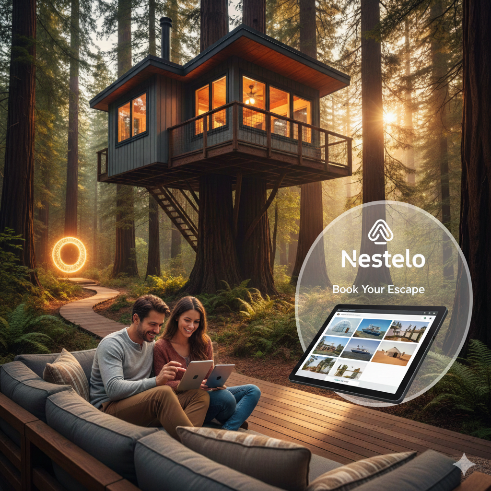
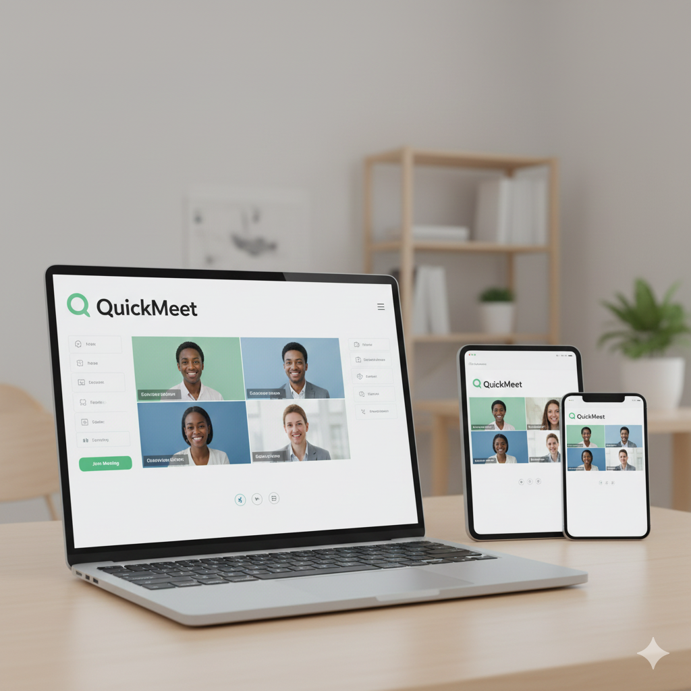
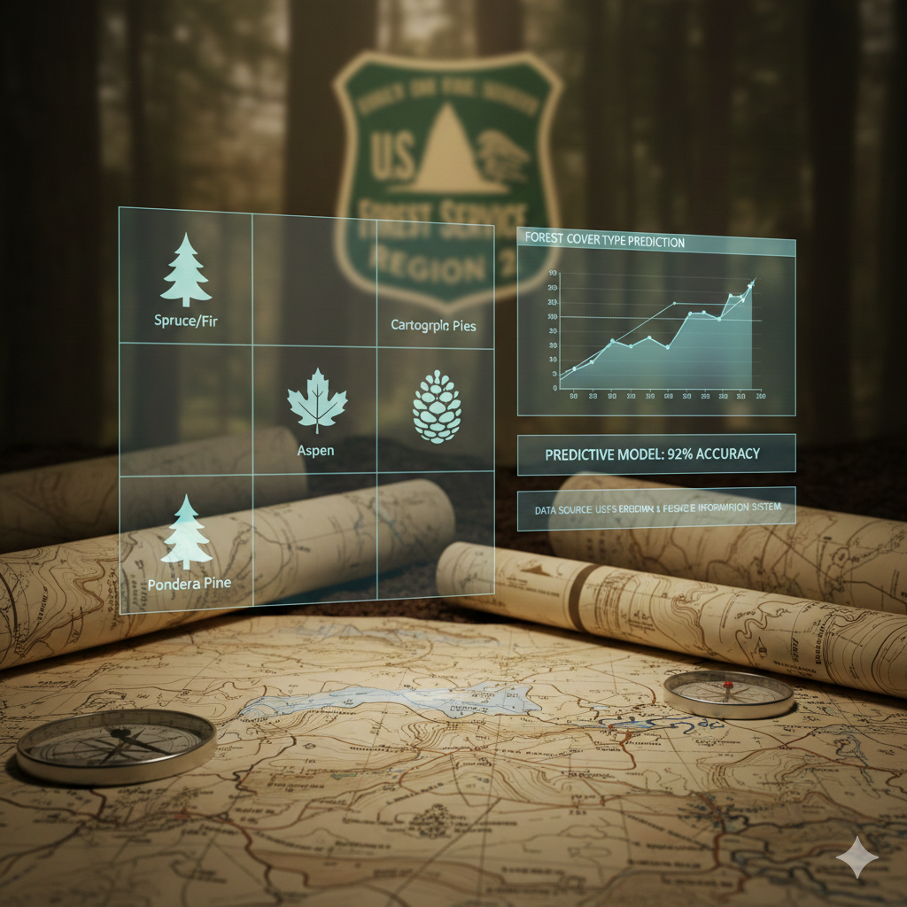

# 🌟 My Portfolio Website


A modern, responsive personal portfolio website showcasing my projects, skills, and professional journey. 

## ✨ Features

- 🎨 **Clean & Modern Design** - Minimalist interface with smooth animations
- 📱 **Fully Responsive** - Optimized for desktop, tablet, and mobile devices
- 🖼️ **Project Showcase** - Gallery of featured work and projects
- 💼 **Professional Layout** - Easy-to-navigate sections for about, skills, and portfolio
- 🎯 **Custom Styling** - Handcrafted CSS for unique visual experience

## 🚀 Live Demo

Visit the live website:  [View Portfolio](codeleox16-somnath.netlify.app)

## 📸 Screenshots

<div align="center">
  
  
  
</div>

## 🛠️ Built With

- **HTML5** - Structure and content
- **CSS3** - Styling and animations
- **Responsive Design** - Mobile-first approach

## 📂 Project Structure

```
My-Portfolio-Website/
├── INDEX.HTML          # Main HTML file
├── style.css           # Custom styles
├── MyImageweb.jpg      # Profile/banner image
├── logo2.png           # Logo assets
├── about2.png          # About section image
├── work-*. png          # Project showcase images
└── README.md           # Project documentation
```

## 🎯 Sections

- **Home** - Eye-catching landing section
- **About** - Professional background and introduction
- **Portfolio** - Showcase of projects and work
- **Contact** - Get in touch information

## 💻 Getting Started

1. **Clone the repository**
   ```bash
   git clone https://github.com/CodeLeoX16/My-Portfolio-Website.git
   ```

2. **Navigate to the project directory**
   ```bash
   cd My-Portfolio-Website
   ```

3. **Open in your browser**
   ```bash
   open INDEX.HTML
   ```
   Or simply double-click the `INDEX.HTML` file

## 🌐 Deployment

This portfolio can be easily deployed on: 
- GitHub Pages
- Netlify
- Vercel
- Any static hosting service

## 📝 Customization

Feel free to fork this repository and customize it for your own use: 
1. Replace images with your own
2. Update content in `INDEX.HTML`
3. Modify styles in `style.css`
4. Add your own projects and information

## 📬 Contact

- **GitHub:** [@CodeLeoX16](https://github.com/CodeLeoX16)
- **Portfolio:** [View Live Site](https://codeleoX16.github.io/My-Portfolio-Website/)

## 📄 License

This project is open source and available under the [MIT License](LICENSE).

## 🙏 Acknowledgments

- Design inspiration from modern portfolio trends
- Icons and images are custom created

---

<div align="center">
  <p>Made with ❤️ by CodeLeoX16</p>
  <p>⭐ Star this repo if you found it helpful!</p>
</div>
